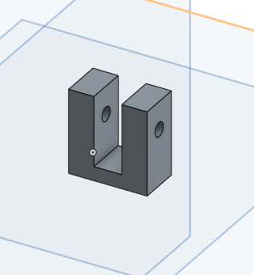
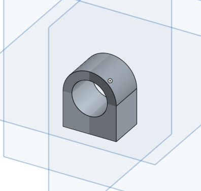
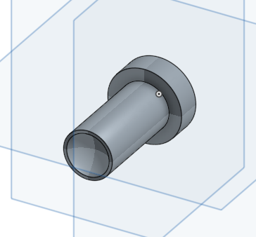

Title: 20161223W15
Date: 2016-12-23 12:00
Category: Misc
Tags: 上課內容,onshape,solvespace
Author: 40423214

##使用onshape畫出零件並組合出連桿機構
<a><a>
<a><a>
<a><a>
<a><a>
<a><a>
<a><a>
<a><a>
<a><a>

##利用限制條件,使機構作相對運動
<iframe src="../solvespace/onshape's tool.html" width="800" height="480"></iframe>